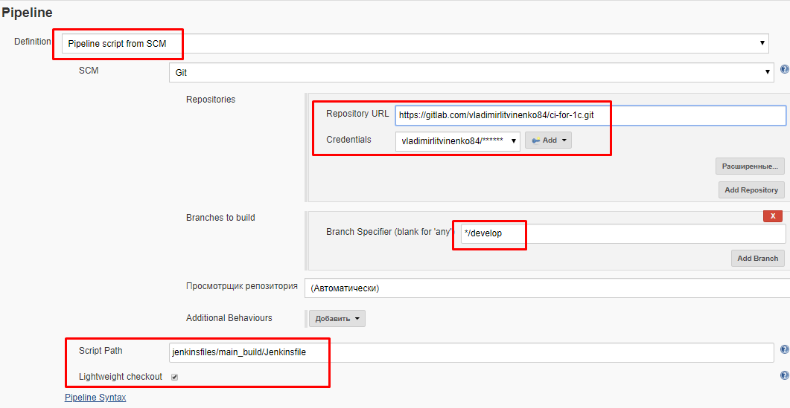

## DevOps

#### Какими системами сборками пользовались?
**Jenkins** — это сервер непрерывной интеграции, написанный на Java. Он является чрезвычайно расширяемой системой из-за внушительной экосистемы разнообразных плагинов.
Настройка пайплайна осуществляется в декларативном или императивном стиле на языке Groovy, а сам файл конфигурации (Jenkinsfile) располагается в системе контроля версий вместе с исходным кодом.

---

#### Отличие CI от CD
**Непрерывная интеграция (CI, Continuous Integration)** — это метод разработки программного обеспечения, при котором изменения кода постоянно интегрируются в репозиторий, далее автоматически происходит следующее:
- опционально: статический анализ кода на уязвимости и несоответствие общим практикам разработки;
- сборка приложения;
- тестируется (проверка конкретных модулей кода, UI, производительности, надёжности API, динамическая проверка на уязвимости).

Таким образом разработчики страхуются от слишком поздних обнаружений проблем в обновлениях.

**Непрерывная доставка (CD, Continuous Delivery)** — CI + CD. Следующий после CI уровень.
Теперь новая версия не только анализируется, собирается и тестируется при каждом изменении кода, регистрируемом в репозитории, но и может быть оперативно запущена по одному нажатию кнопки развёртывания.
Однако запуск развёртывания всё ещё происходит вручную — ту самую кнопку всё же надо кому-то нажать.
Для этого по результатам сборки происходит упаковка сервиса в docker image и загрузка его в image repository (местный аналог docker hub), для дальнейшего использования в процессе.
Этот метод позволяет выпускать изменения небольшими партиями, которые легко изменить или устранить в случае необходимости.

*Дополнительно*
**Непрерывное развёртывание (CD, Continuous Deployment)** — CI +CD + CD. После автоматизации релиза остаётся один ручной этап: одобрение и запуск развёртывания в продакшен.
Практика непрерывного развёртывания упраздняет и это, не требуя непосредственного утверждения со стороны разработчика. Все изменения развёртываются автоматически.

Подробнее см. [здесь](https://timeweb.com/ru/community/articles/ci-cd-i-snova-cd-princip-raboty-i-otlichiya) и [здесь](https://simpleone.ru/glossary/ci-cd-cd-continuous-integration-continuous-delivery-continuous-deployment/).

---

#### Отличие Jenkins от Teamcity
**Jenkins:**

Плюсы:
- бесплатный инструмент CI
- может интегрироваться практически с любой внешней программой, используемой для разработки приложений. Это позволяет использовать контейнерные технологии, такие как Docker и Kubernetes, из коробки.

Минусы:
- устаревший интерфейс
- плохая документация

**Teamcity**

Плюсы:
- Хорошая документация и поддержка
- Простота настройки
- Современный интерфейс

Минусы:
- Платный для Enterprise
- Ручное обновление

Подробнее см. [здесь](https://medium.com/successivetech/teamcity-vs-jenkins-choosing-the-right-ci-cd-tool-ab353b377a37).

---

#### Что такое pipeline в Jenkins
Jenkins Pipeline — набор плагинов, позволяющий определить жизненный цикл сборки и доставки приложения.
Он представляет собой Groovy-скрипт с использованием Jenkins Pipeline DSL, который хранится в системе контроля версий.

---

#### Все ли Groovy фичи мне доступны в Jenkins pipeline? Могу ли я запретить опасные методы?
В Jenkins применяется не чистый Groovy, а его подмножество с различными ограничениями и надстройками.
Например, можно создавать объекты, доступные в той JRE (Java-машине) которая у Вас установлена на сборочных узлах.
Сам Jenkins тоже предоставляет дополнительные Java-классы, расширяя возможности своих Groovy-скриптов.
Но как из-за ограничений самого Jenkins, так и из целей безопасности доступ ко многим возможностям Java ограничен.

---

#### Что такое Jenkins Node и как они используются
Jenkins Node - это машина на которой выполняются сборки.

---

#### Могу ли я скрипт сборки хранить в Git
Да, можно.

---

#### Про какие системы управления конфигурации слышал (ansible, puppet, chef)
ToDo: ответ

---